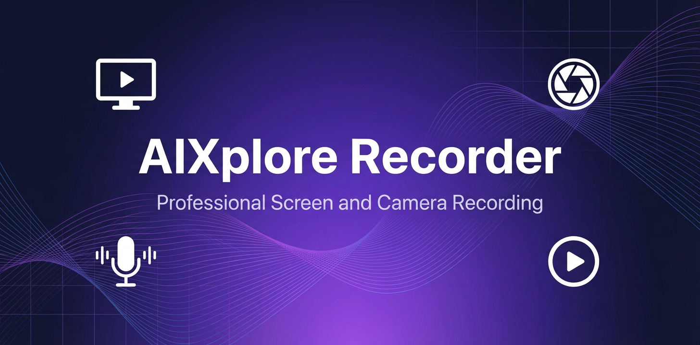

<p align="center">
  
</p>

<h1 align="center">AIXplore Recorder</h1>

<p align="center">
  <strong>Professional screen &amp; camera recording for macOS</strong>
</p>

<p align="center">
  <a href="LICENSE"></a>
  
  
  
</p>

---

AIXplore Recorder is a lightweight, native desktop application for recording your screen or capturing audio — with optional webcam overlay, microphone input, and system audio capture. Built with Electron, it delivers a polished recording experience with real-time preview, trimming, and multiple export formats — all in a single, focused tool.

<p align="center">
  
</p>

<p align="center">
  
</p>

## Features

- **Screen & Window Capture** — Record any screen or individual application window
- **Audio-Only Recording** — Capture microphone audio without a screen source — ideal for discussions, interviews, and meetings
- **Webcam Picture-in-Picture** — Circular, draggable webcam overlay in three sizes (S/M/L)
- **Audio Capture** — Microphone and system audio loopback, with real-time level meter and waveform visualizer
- **Countdown Timer** — Optional 3s or 5s countdown before recording starts
- **Pause & Resume** — Pause recordings mid-session and resume seamlessly
- **Video & Audio Trimming** — Set start/end points before saving, with live preview
- **Multiple Export Formats** — Save as WebM (instant), trimmed WebM, MP4, MP3, or M4A via FFmpeg
- **Recording Presets** — One-click setting profiles; save custom presets for any workflow
- **Keyboard Shortcuts** — `Ctrl+Shift+R` to record, `Ctrl+Shift+P` to pause, `Esc` to stop
- **System Tray** — Quick-start video or audio recording directly from the menu bar; blinking indicator during active recording
- **Configurable Output** — Choose your save directory; select your audio input device

## Quick Start

### Prerequisites

- **macOS** 12 or later
- **Node.js** 18+ and npm

### Install & Run

```bash
# Clone the repository
git clone https://github.com/rartzi/aixplore-recorder.git
cd aixplore-recorder

# Install dependencies
npm install

# Launch the app
npm start
```

### Build for Distribution

```bash
npm run build
```

This produces a macOS `.dmg` in the `dist/` directory using electron-builder.

## Usage

### Video + Audio recording
1. **Select a source** — Choose a screen or window from the source picker
2. **Configure inputs** — Toggle webcam, microphone, and system audio; set countdown
3. **Record** — Click **Start Recording** or press `Ctrl+Shift+R`
4. **Review & trim** — After stopping, adjust start/end trim points
5. **Export** — Save as WebM (instant), trimmed WebM, or MP4

### Audio-only recording
1. **Switch mode** — Click **🎙 Audio Only** at the top of the picker (or use the tray)
2. **Record** — Click **Start Audio Recording** — no screen source needed
3. **Review & trim** — Adjust trim points on the audio player
4. **Export** — Save as WebM, trimmed WebM, MP3, or M4A

For detailed instructions, see the [User Guide](docs/user-guide.md).

## Keyboard Shortcuts

| Shortcut | Action |
|---|---|
| `Ctrl+Shift+R` | Start / toggle recording |
| `Ctrl+Shift+P` | Pause / resume |
| `Esc` | Stop recording |

## Architecture

```
src/
├── main.js       # Electron main process — window, tray, IPC handlers, FFmpeg
├── preload.js    # Secure IPC bridge between main and renderer
└── index.html    # Complete UI — source picker, recording view, trim editor
```

The application follows Electron's security best practices with `contextIsolation` enabled and `nodeIntegration` disabled. All file system operations and FFmpeg calls run in the main process, exposed to the renderer through a secure preload bridge.

## Documentation

| Document | Description |
|---|---|
| [User Guide](docs/user-guide.md) | Complete walkthrough of all features |
| [Architecture](docs/architecture.md) | Technical design and data flow |
| [Contributing](CONTRIBUTING.md) | How to contribute to this project |

## Tech Stack

- **[Electron](https://www.electronjs.org/)** v35 — Cross-platform desktop framework
- **Vanilla JavaScript** — No UI framework dependencies
- **[FFmpeg](https://ffmpeg.org/)** — Video trimming and MP4 conversion
- **Web APIs** — MediaRecorder, Canvas, AudioContext, getUserMedia

## Contributing

Contributions are welcome. Please read [CONTRIBUTING.md](CONTRIBUTING.md) before submitting a pull request.

## License

This project is licensed under the Apache License 2.0 — see the [LICENSE](LICENSE) file for details.

```
Copyright 2024-2026 AIXplore Labs

Licensed under the Apache License, Version 2.0
```

---

<p align="center">
  Built with care by <strong>AIXplore Labs</strong>
</p>
