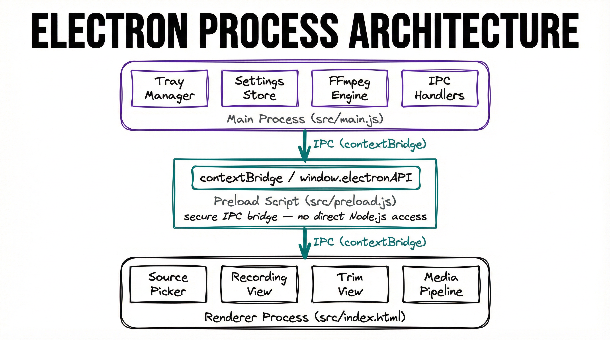
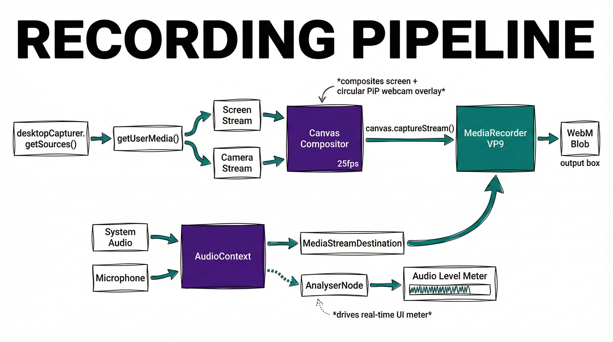

# AIXplore Recorder — Architecture

This document describes the technical architecture, data flow, and design decisions behind AIXplore Recorder.

## Overview

AIXplore Recorder is a single-window Electron application built with three source files and no external UI frameworks. The architecture follows Electron's recommended security model with strict process isolation.



## Process Model

### Main Process (`src/main.js`)

Responsibilities:
- Window creation and lifecycle management
- System tray icon with recording status (blinking indicator)
- Global keyboard shortcut registration
- File system operations (save, delete temp files)
- FFmpeg execution for trimming and MP4 conversion
- IPC handler registration for all renderer requests
- macOS permission requests (camera, microphone, screen capture)

### Preload Script (`src/preload.js`)

Acts as a secure bridge using Electron's `contextBridge` API. Exposes a `window.electronAPI` object with methods that map to IPC handlers. This ensures the renderer process never has direct access to Node.js APIs.

### Renderer Process (`src/index.html`)

A single HTML file containing all UI markup, CSS styles, and JavaScript logic. Manages three views:

1. **Source Picker** — Grid of available screens/windows with input toggles
2. **Recording View** — Live preview with control bar
3. **Trim View** — Video playback with trim sliders and export buttons

## Recording Pipeline



The canvas compositor runs at 25fps, drawing the screen capture as the base layer and overlaying the webcam feed as a circular PiP. The webcam is rendered with:
- Circular clipping mask
- Horizontal mirror transform
- Purple border stroke
- Position based on drag coordinates

Both audio sources feed into an `AudioContext` destination node. An `AnalyserNode` taps the combined signal to drive the real-time audio level meter in the UI.

## Export Pipeline


Three export paths are available:

- **WebM Instant** — No re-encoding. The raw blob is streamed to a temp file, then copied to the output path. Fastest option.
- **WebM Trimmed** — Uses FFmpeg stream copy (`-c copy`) for fast, lossless trimming. No re-encoding.
- **MP4 Conversion** — Full transcode via FFmpeg: `libx264` ultrafast preset at CRF 28, `aac` at 128k, with `+faststart` for web-optimized playback.

Conversion progress is reported back to the renderer via IPC for UI updates.

## Security Model

- `contextIsolation: true` — Renderer cannot access Node.js globals
- `nodeIntegration: false` — No `require()` in renderer
- `sandbox: false` — Required for preload script to access Node.js `fs` module for temp file streaming
- **Content Security Policy** — Restricts resource loading to `self`, `blob:`, and `mediastream:` origins
- **Path validation** — All IPC handlers validate temp file paths (must originate from `os.tmpdir()` with `aixplore-rec-` prefix)
- **Output path restriction** — `show-in-finder` and `open-file` only accept paths within the configured output directory
- **Input sanitization** — FFmpeg trim parameters are validated as finite positive numbers
- **Settings whitelist** — Only `outputDir` (string) and `autoSave` (boolean) are accepted via `set-settings`
- **Unpredictable temp files** — Temp filenames use `crypto.randomBytes` instead of timestamps
- All file I/O runs in the main process behind IPC handlers
- macOS entitlements are declared in `entitlements.mac.plist` for camera, microphone, and screen capture

## File Naming Convention

```
AIXplore-YYYY-MM-DD_HHhMMmSSs.{webm|mp4}
```

Generated in the main process using the local system clock at save time.

## Dependencies

| Package | Purpose |
|---|---|
| `electron` | Desktop application framework |
| `electron-builder` | Build and package for macOS distribution |
| `@ffmpeg-installer/ffmpeg` | Bundled FFmpeg binary for trimming and conversion |

No runtime UI frameworks or libraries. The entire UI is vanilla HTML/CSS/JS.
