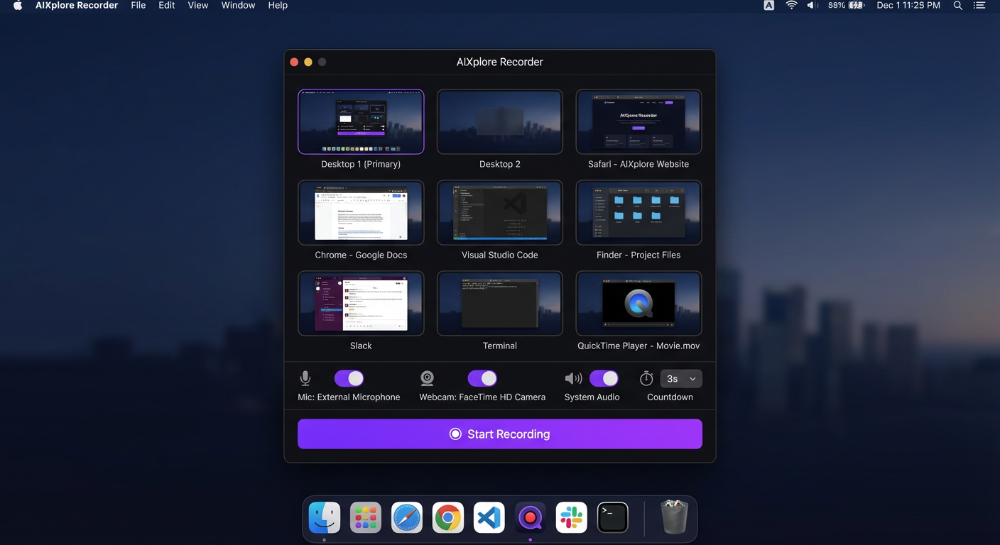
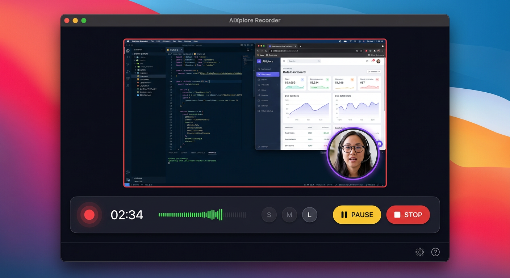

# AIXplore Recorder — User Guide

This guide covers everything you need to know to record, edit, and export with AIXplore Recorder — including screen recording and the audio-only recording mode.

## Table of Contents

- [System Requirements](#system-requirements)
- [Installation](#installation)
- [First Launch & Permissions](#first-launch--permissions)
- [Recording Modes](#recording-modes)
- [Recording a Screen or Window](#recording-a-screen-or-window)
- [Audio-Only Recording](#audio-only-recording)
- [Using the Webcam Overlay](#using-the-webcam-overlay)
- [Audio Configuration](#audio-configuration)
- [Recording Controls](#recording-controls)
- [Trimming Your Recording](#trimming-your-recording)
- [Exporting & Saving](#exporting--saving)
- [Recording Presets](#recording-presets)
- [System Tray](#system-tray)
- [Settings](#settings)
- [Bulk Delete](#bulk-delete)
- [Export to Folder](#export-to-folder)
- [Auto-Copy on Save](#auto-copy-on-save)
- [Convert WebM in History](#convert-webm-in-history)
- [Keyboard Shortcuts](#keyboard-shortcuts)
- [Troubleshooting](#troubleshooting)

---

## System Requirements

| Requirement | Minimum |
|---|---|
| Operating System | macOS 12 (Monterey) or later |
| Node.js | v18 or later |
| Disk Space | ~200 MB (including dependencies) |
| RAM | 4 GB recommended |

## Installation

### Running from Source (Development)

```bash
git clone https://github.com/rartzi/aixplore-recorder.git
cd aixplore-recorder
npm install
npm start
```

### Building for Distribution

To build a distributable macOS application:

```bash
npm run build
```

This uses `electron-builder` to produce the following artifacts in the `dist/` directory:

| File | Description |
|---|---|
| `dist/mac-arm64/AIXplore Recorder.app` | Standalone application bundle |
| `dist/AIXplore Recorder-<version>-arm64.dmg` | Disk image for distribution |
| `dist/AIXplore Recorder-<version>-arm64-mac.zip` | Zipped app for direct sharing |

To install the built app, open the `.dmg` and drag **AIXplore Recorder** to your Applications folder, or run the `.app` directly.

### Code Signing & Notarization

By default, the build produces an **ad-hoc signed** application. macOS Gatekeeper will show a warning when opening it for the first time. To bypass this, right-click the app and select **Open**.

For proper distribution (no Gatekeeper warnings), you need:

1. An **Apple Developer ID** certificate — configure it in the `build.mac` section of `package.json` or via the `CSC_LINK` / `CSC_KEY_PASSWORD` environment variables
2. **Notarization** — add `notarize` options to the `build.mac` config or use `electron-builder`'s `afterSign` hook with `@electron/notarize`

See the [electron-builder code signing docs](https://www.electron.build/code-signing) for full details.

## First Launch & Permissions

On first launch, macOS will prompt you to grant three permissions:

1. **Screen Recording** — Required to capture your screen or application windows
2. **Camera** — Required for the webcam overlay feature
3. **Microphone** — Required for audio recording

If you miss a prompt, go to **System Settings > Privacy & Security** and enable each permission for AIXplore Recorder manually. You may need to restart the app after granting permissions.

> **Tip:** The app will retry loading screen sources up to 3 times automatically while waiting for the Screen Recording permission to take effect.

## Recording Modes

AIXplore Recorder supports two distinct recording modes, switchable at the top of the source picker:

| Mode | Button | What it captures |
|---|---|---|
| **Video + Audio** | 🎥 Video + Audio | Screen or window video + optional mic and system audio |
| **Audio Only** | 🎙 Audio Only | Microphone only — no screen source required |

You can also start either mode instantly from the **system tray** without opening the main window.

---

## Recording a Screen or Window

### Step 1: Select a Source

When the app launches, you see the **Source Picker** view. It displays thumbnails of all available screens and windows.



- Click on any thumbnail to select it as your recording source
- The selected source is highlighted with a purple border
- Click **Refresh** if a window you opened recently doesn't appear

### Step 2: Configure Inputs

Below the source grid, you'll find toggle switches:

| Toggle | Default | Description |
|---|---|---|
| **Webcam** | On | Adds a circular picture-in-picture webcam overlay |
| **Mic** | On | Captures audio from your microphone |
| **System Audio** | Off | Captures audio output from your system |
| **Countdown** | 3s | Countdown delay before recording starts (None / 3s / 5s) |

### Step 3: Start Recording

Click the **Start Recording** button (or press `Ctrl+Shift+R`). If a countdown is set, you'll see a large countdown number overlay before recording begins.

---

## Audio-Only Recording

Audio-only mode captures your microphone without requiring a screen source. Use it for discussions, interviews, voice memos, or any situation where you don't need to record your screen.

### Starting an audio-only recording

**From the picker:**
1. Click **🎙 Audio Only** at the top of the source picker
2. The source grid, webcam toggle, system audio toggle, and cursor FX toggle are hidden — they are not applicable in this mode
3. Confirm the **Mic** toggle is on
4. Click **Start Audio Recording**

**From the tray:**
- Click the menu bar icon and select **🎙 Audio Only** — recording starts immediately, no window required

### During recording

The recording view shows a **waveform visualizer** — 30 animated bars driven by live microphone levels — along with a timer and the standard PAUSE / STOP controls.

### System audio in audio-only mode

System audio loopback is **not available** in audio-only mode. Loopback requires a screen capture session (macOS constraint). If you need to record both your mic and what you hear through your speakers (e.g. a phone or video call), use **Video + Audio** mode with both **Mic** and **System Audio** toggles on.

> **Teams / video call tip:** To capture both sides of a call, use Video + Audio mode with System Audio ON. The loopback captures your call partner's voice as played through your speakers or headphones — including AirPods.

### Exporting audio-only recordings

After stopping, the **Audio Trim view** offers:

| Button | Description |
|---|---|
| **Save WebM (instant)** | Save the full recording as WebM/Opus — fastest option |
| **Save Trimmed WebM** | Trim and save as WebM via FFmpeg |
| **Save as MP3** | Export as 192k MP3 — widely compatible |
| **Save as M4A** | Export as 192k AAC in M4A container |

All audio files are saved with the prefix `AIXplore-Audio-YYYY-MM-DD_HHhMMmSSs`.

---

## Using the Webcam Overlay

When the Webcam toggle is enabled, a circular picture-in-picture window appears in the bottom-right corner of the preview during recording.

### Moving the Overlay

Click and drag the webcam circle to reposition it anywhere within the preview area. The position is preserved in the final recording.

### Resizing the Overlay

Use the size buttons in the control bar:

| Button | Size |
|---|---|
| **S** | 100px — Small, unobtrusive |
| **M** | 160px — Medium (default) |
| **L** | 220px — Large, prominent |

The webcam feed is automatically mirrored horizontally for a natural appearance and rendered as a circle with a purple border.

## Audio Configuration

### Microphone Audio

When the **Mic** toggle is on, the app captures audio from your default microphone. The audio level meter in the control bar shows real-time input levels.

### System Audio

When the **System Audio** toggle is on, the app captures desktop audio output (what you hear through your speakers). This is useful for recording presentations with sound, video playback, or software demos.

Both audio sources are mixed together in the final recording when both are enabled.

## Recording Controls



During an active recording, the control bar provides:

| Control | Description |
|---|---|
| **Red dot** | Pulsing indicator — recording is active. Turns yellow when paused. |
| **Timer** | Elapsed recording time in `MM:SS` format |
| **Audio meter** | Green bar showing current audio input level |
| **PiP size buttons** | Resize the webcam overlay (S / M / L) |
| **PAUSE** | Pause the recording. Click again (RESUME) to continue. |
| **STOP** | Stop recording and open the trim editor |

## Trimming Your Recording

After stopping a recording, you are taken to the **Trim View**:

1. A video player shows your full recording with playback controls
2. Two sliders let you set the **Start** and **End** trim points
3. Time labels update in real-time as you drag the sliders

### Trim Workflow

1. Play the video to identify the sections you want to keep
2. Drag the **Start** slider to skip unwanted footage at the beginning
3. Drag the **End** slider to cut unwanted footage at the end
4. Choose your save option (see below)

## Exporting & Saving

### Video recordings (trim view)

| Button | Description |
|---|---|
| **Discard** | Delete the recording and return to the source picker |
| **Re-record** | Discard and immediately start a new recording with the same source |
| **Save Full (instant)** | Save the entire recording as WebM without re-encoding |
| **Save Trimmed** | Save only the trimmed portion as WebM using FFmpeg |
| **Save as MP4** | Convert to MP4 (H.264 + AAC) using FFmpeg. Applies trim if set. |

### Audio recordings (audio trim view)

| Button | Description |
|---|---|
| **Discard** | Delete the recording and return to the picker |
| **Re-record** | Discard and immediately start a new audio recording |
| **Save WebM (instant)** | Save the full recording as WebM/Opus without re-encoding |
| **Save Trimmed WebM** | Trim and save as WebM |
| **Save as MP3** | Export as 192k MP3 via FFmpeg |
| **Save as M4A** | Export as 192k AAC in M4A container via FFmpeg |

### File Naming

All recordings are saved with automatic filenames:

```
AIXplore-YYYY-MM-DD_HHhMMmSSs.webm      ← video recording
AIXplore-YYYY-MM-DD_HHhMMmSSs.mp4       ← video recording
AIXplore-Audio-YYYY-MM-DD_HHhMMmSSs.webm ← audio-only recording
AIXplore-Audio-YYYY-MM-DD_HHhMMmSSs.mp3  ← audio-only recording
AIXplore-Audio-YYYY-MM-DD_HHhMMmSSs.m4a  ← audio-only recording
```

### After Saving

A banner appears at the bottom of the window showing the saved file path with two options:

- **Show in Finder** — Opens the containing folder in Finder
- **Play** — Opens the file in your default video player

## Recording Presets

Presets let you save your current configuration as a named profile and apply it in one click from the picker or tray.

### Built-in presets

| Preset | Mode | Settings |
|---|---|---|
| Tutorial | 🎥 Video | High quality, 30fps, 3s countdown, cam + mic |
| Quick Demo | 🎥 Video | Medium quality, 30fps, no countdown, mic only |
| Presentation | 🎥 Video | High quality, 30fps, 5s countdown, mic + system audio |
| Audio Recording | 🎙 Audio Only | Medium quality, no countdown, mic only |

### Creating a custom preset

1. Configure the picker (mode, toggles, countdown) as desired
2. Click **Save Current as Preset** and give it a name
3. The preset appears in the selector and in the tray Presets submenu

### Setting a default preset

In **Settings → Presets**, select a preset from the Default dropdown. It is automatically applied each time you open the source picker.

---

## System Tray

Click the menu bar icon to access:

| Item | Action |
|---|---|
| **🎥 Video + Audio** | Open the source picker in Video mode |
| **🎙 Audio Only** | Start an audio-only recording immediately |
| **Presets submenu** | Apply any preset — 🎥 video presets open the picker, 🎙 audio presets start recording directly |
| **■ Stop Recording** | Stop the active recording (shown during recording) |
| **⏸ Pause / ▶ Resume** | Pause or resume (shown during recording) |
| **Cursor FX** | Toggle click spotlight on/off |
| **Settings…** | Open the settings page |

---

## Settings

### Output Directory

Click the **Change** button next to the save path to select a custom output directory. The default is:

```
~/Videos/AIXplore Recordings/
```

The directory is created automatically if it doesn't exist.

### Auto-Save

When enabled in settings, recordings are saved automatically without showing the trim view.

## Bulk Delete

Delete multiple recordings at once from the History view.

1. Open the **History** view from the sidebar
2. Click the **Select** button in the toolbar (top right)
3. Check individual recordings or click **Select All** in the action bar
4. A floating action bar appears at the bottom showing the count of selected items
5. Click **Delete (N)** to remove all selected recordings
6. Confirm the deletion in the dialog — files are permanently removed from disk
7. Click **Cancel** to exit select mode without deleting

---

## Export to Folder

Copy selected recordings to another folder without removing them from the original location.

1. Enter select mode by clicking **Select** in the History toolbar
2. Check the recordings you want to export
3. Click **Export (N)** in the action bar
4. Choose a destination folder in the file picker
5. The app copies each selected file to the destination — existing files with the same name are skipped
6. A summary shows how many files were exported, skipped, or not found

---

## Auto-Copy on Save

Automatically copy every new recording to a secondary folder as soon as it is saved. Useful for syncing recordings to a shared drive, backup folder, or cloud-synced directory.

### Setting up

1. Open **Settings** from the sidebar
2. Under **Output**, find **Secondary Output Folder**
3. Click **Choose...** and select the target folder
4. The path is displayed next to the label

### How it works

- Every time a recording is saved (any format — WebM, MP4, MP3, M4A), a copy is automatically placed in the secondary folder
- If the secondary folder does not exist or is unreachable, the copy is silently skipped — the primary save always succeeds
- Files with the same name already in the secondary folder are not overwritten

### Removing the secondary folder

Click **Clear** next to the path to disable auto-copy.

---

## Rename a Recording

Give any recording a meaningful name directly from the History view — without leaving the app.

### How to rename

1. Open the **History** view from the sidebar
2. Hover over a recording row — a **✏️** button appears in the actions area
3. Click **✏️** — the filename becomes an editable text input and **✓ / ✗** buttons appear (extension is preserved automatically)
4. Type the new name, then:
   - Click **✓** or press **Enter** to save
   - Click **✗** or press **Escape** to cancel
5. The file is renamed on disk and History updates immediately

### Auto-detect renames from Finder

If you rename a recording directly in Finder or another app, AIXplore Recorder detects the change automatically and updates the History entry — no manual refresh needed.

---

## Convert WebM in History

Convert any saved WebM recording to MP4, MP3, or M4A directly from the History view — no need to re-record.

- **Video WebM** rows show a **→ MP4** button
- **Audio WebM** rows show **→ MP3** and **→ M4A** buttons

### Steps

1. Open the **History** view from the sidebar
2. Find the WebM recording you want to convert
3. Click **→ MP4**, **→ MP3**, or **→ M4A**
4. A dialog asks: **Keep original WebM?**
   - **OK** — converts and keeps the original WebM (both files in History)
   - **Cancel** — converts and replaces the original WebM
5. The converted file is added to History and auto-copied to your secondary folder if configured

---

## Keyboard Shortcuts

These shortcuts work globally while the app is running:

| Shortcut | Action |
|---|---|
| `Ctrl+Shift+R` | Start recording / toggle record |
| `Ctrl+Shift+P` | Pause / resume recording |
| `Esc` | Stop recording |

## Troubleshooting

### No screens appear in the source picker

1. Open **System Settings > Privacy & Security > Screen Recording**
2. Find AIXplore Recorder in the list and enable it
3. Restart the application
4. Click **Refresh** in the source picker

### Webcam not working

1. Open **System Settings > Privacy & Security > Camera**
2. Ensure AIXplore Recorder has camera access enabled
3. Close other applications that may be using the camera
4. Restart the application

### No audio in recording

1. Check that the **Mic** and/or **System Audio** toggles are enabled
2. Open **System Settings > Privacy & Security > Microphone**
3. Ensure AIXplore Recorder has microphone access
4. Check that the audio level meter shows activity during recording

### MP4 conversion fails

MP4 conversion uses FFmpeg bundled with the app. If conversion fails:

1. Check that you have sufficient disk space
2. Try saving as WebM first (instant save, no conversion needed)
3. Check the terminal output for FFmpeg error messages

### Recording is choppy or laggy

- Close unnecessary applications to free system resources
- Record at the native screen resolution rather than a scaled window
- Ensure your Mac isn't in low-power mode
